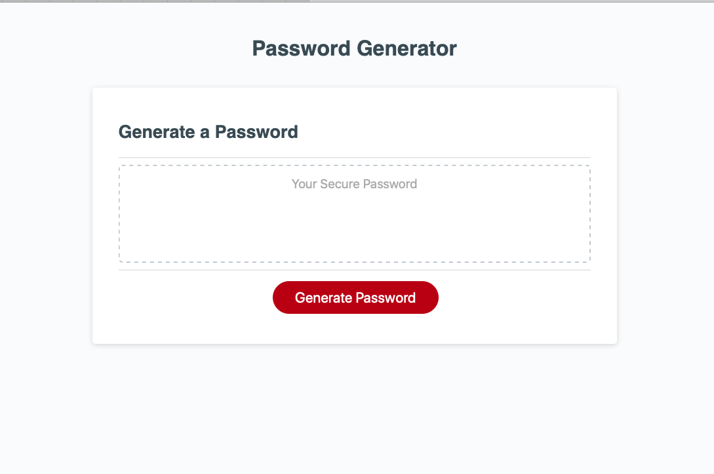

# password_generator
This is a password generator created by Andrew Crow that generates a random password based on user-selected criteria. This app will run in the browser and feature dynamically updated HTML and CSS powered by JavaScript code. It has a clean and polished user interface and is responsive.



### Below I will break down the code:


This is creating a variable for the generate id in the DOM that we will call later
  
  ```javascript
  let generateBtn = document.querySelector("#generate");
  ```

This is the workhorse of the app and will call all the functions to present the password to the user.
The is declaring the variable passwordLength and invoking the function getValidLengthOfPassword. Then declaring the the variable userResponse and invoking the getValidCriteria function. Then we declare the variable password and invoke the generatePassword function and pass into it the array values from userResponse and value from passwordLength. We then set the variable passwordText to the password if in the DOM. Lastly we make the value passwordText.value equal the variable password. This will will present the generated password to the user.

  ```javascript
  function writePassword() {
    const passwordLength = getValidLengthOfPassword();
    const userResponse = getValidCriteria();
    let password = generatePassword(userResponse[0],userResponse[1],userResponse[2],userResponse[3], passwordLength);
  let passwordText = document.querySelector("#password");
   passwordText.value = password;  
  }
  ```

This is an event listener waiting for the user to click the generate button that we declared earlier. When pressed it runs the writePassword function created above.

  ```javascript
  generateBtn.addEventListener("click", writePassword);
  ```
This is next part is the random password generator and where the magic happens. I will break this park down line by line.
  
1. First it is creating the function generatePassword and setting the parameters of lowerCase, upperCase, number, symbol
and length
    ```javascript
    function generatePassword(lowerCase, upperCase, number, symbol, length){
    ```
2. Second we are clearing generatedPassword variable
    ```javascript
    let generatedPassword = "";
    ```
3. Third it is creating the variable characterTypesCount and giving it the value of the count of each character type marked true
    ```javascript
    const characterTypesCount = lowerCase + upperCase + number + symbol;
    ```
4. Fourth it is creating the array characterTypesArray and only including the values marked true
    ```javascript
    const characterTypesArray = [{lowerCase}, {upperCase}, {number}, {symbol}].filter(characterType => Object.values(characterType)[0]);
    ```
5. Fifth it is running a for loop that loops as many times as times as need to fill the required password length. Each loop will add the variable characterTypesCount to the variable i. Loops stops when i is greater than or equal to the user inputted password length
    ```javascript
    for(let i=0; i<length; i+=characterTypesCount) {
6. Inside this loop for each character type in array characterTypesArray grab one random character from that character type method from the object generateRandomValues and add those to the generatedPassword variable.
    ```javascript
    characterTypesArray.forEach(characterType => {
      generatedPassword += generateRandomValues[Object.keys(characterType)[0]]();
      });
    }
    ```
7. Lastly it returns a truncated generatedPassword variable to the requested size inputted by the user because the above loop may generate more characters than needed
    ```javascript
      return generatedPassword.slice(0, length);
      }
    ```

This function getValidLengthOfPassword that is called above in the writePassword function prompts the user for password length and tests to see if password length is between 8-128 and a number. It then returns the user inputted value if it is valid or an alert asking for valid number form 8 to 128
  ```javascript
  function getValidLengthOfPassword(){
    while (true) {
      userInputLengthOfPassword = prompt("How long do you want your password?", "Please enter a number from 8 to 128.");
      if (isNaN(userInputLengthOfPassword) === false && userInputLengthOfPassword > 7 && userInputLengthOfPassword <129) {
        return userInputLengthOfPassword;
      }
      alert("Please enter a valid length from 8 to 128");
    }
  }
  ```

This function getValidCriteria that is called above in the writePassword function prompts the user for criteria and test to make sure the user selected ay least one character type. It then returns an array of each of the users choices or errors and asks the user to select at least one character option.
  ```javascript
  function getValidCriteria(){
    while(true) {
      includeLowerCase = confirm("Do you want to include lower case letters?\nClick Ok for Yes and Cancel for No");
      includeUpperCase = confirm("Do you want to include upper case letters?\nClick Ok for Yes and Cancel for No");
      includeNumbers = confirm("Do you want to include numbers?\nClick Ok for Yes and Cancel for No");
      includeSpecialCharacters = confirm("Do you want to include special characters?\nClick Ok for Yes and Cancel for No");
      if (includeLowerCase || includeUpperCase || includeNumbers || includeSpecialCharacters) {
        return [includeLowerCase, includeUpperCase, includeNumbers, includeSpecialCharacters];
      } 
      alert("You must select at least one type of character.")
    }
  }
  ```
This is creating an object that includes random values for Properties by embedding the methods into the object. I'll break this down line by line.
1. This is creating the object generateRandomValues
    ```javascript 
    const generateRandomValues = {
    ```
2. This generates a random single lowercase character from the ASCII Character Set https://www.w3schools.com/charsets/ref_html_ascii.asp and adds it to value for the property lowerCase. We multiple Math.random by 26 because there are 26 letters in the alphabet. Additionally, we add 97 to Math.floor(Math.random()*26) because lowercase numbers start at 97 in the ASCII Character Set
    ```javascript
    lowerCase : () => {return String.fromCharCode(Math.floor(Math.random()*26)+97)},
    ```
3. This generates a random single uppercase character from the ASCII Character Set https://www.w3schools.com/charsets/ref_html_ascii.asp and adds it to value for the property upperCase. We multiple Math.random by 26 because there are 26 letters in the alphabet. Additionally, we add 65 to Math.floor(Math.random()*26) because uppercase numbers start at 97 in the ASCII Character Set
    ```javascript
    upperCase : () => {return String.fromCharCode(Math.floor(Math.random()*26)+65)},
    ```
4. This generates a random single integer from 0 to 9 and adds it to the value for the property number. We multiple Math.random() by 10 because there are 10 integers from 0 to 9
    ```javascript
    number : () => {return Math.floor(Math.random()*10)},
    ```
5. This generates a random single special character and adds it to the value for the property symbol
    ```javascript
    symbol : () => {
                  // Defines the variable specialCharacters as the string including all available special characters
                  const specialCharacters =  "!#$%&'()*+,-./:;<=>?@[]^_`{|}~\"\\"
                  // Multiple a random number by the variable specialCharacters length and returns the place in the string corresponding to that value
                  return specialCharacters[Math.floor(Math.random()*specialCharacters.length)]
                  }
    };
    ```